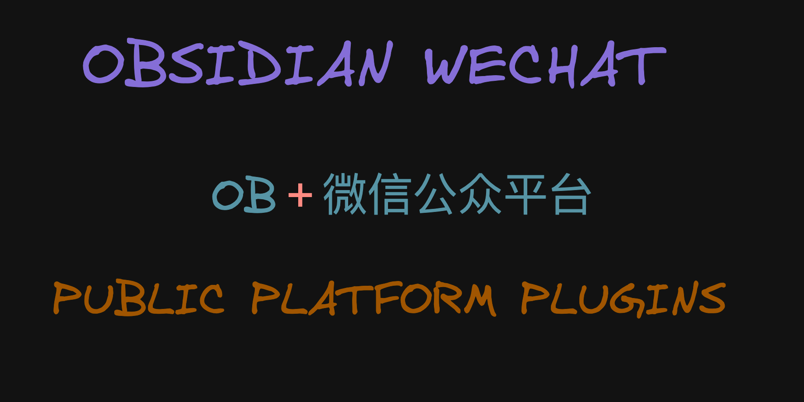
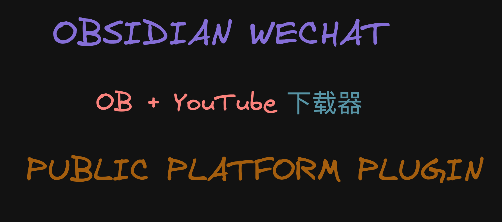
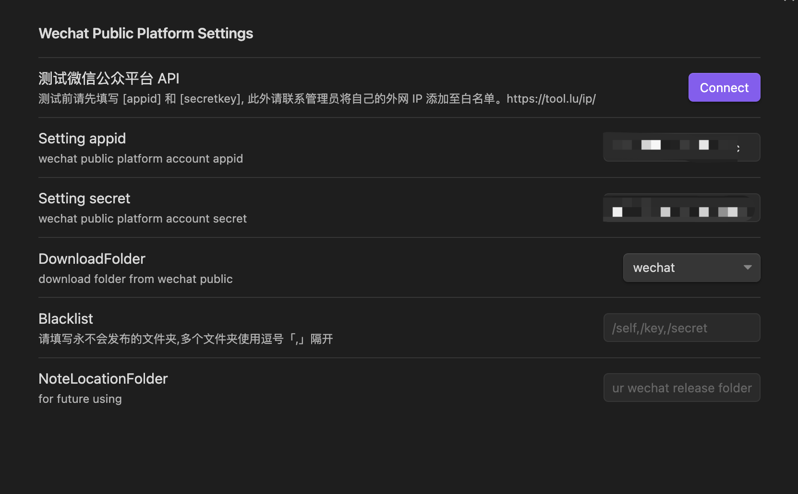
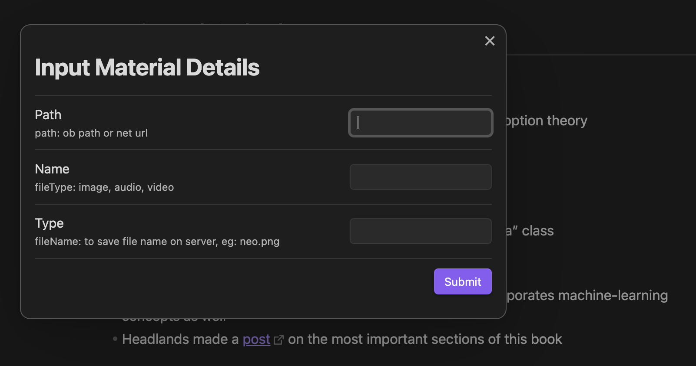
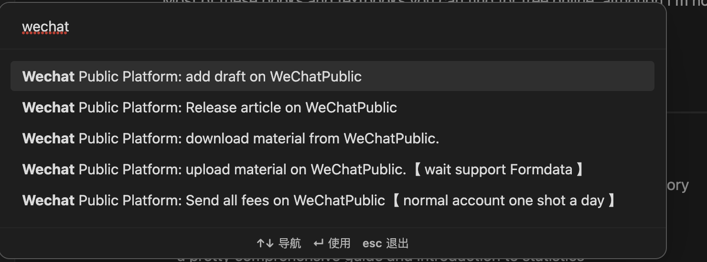
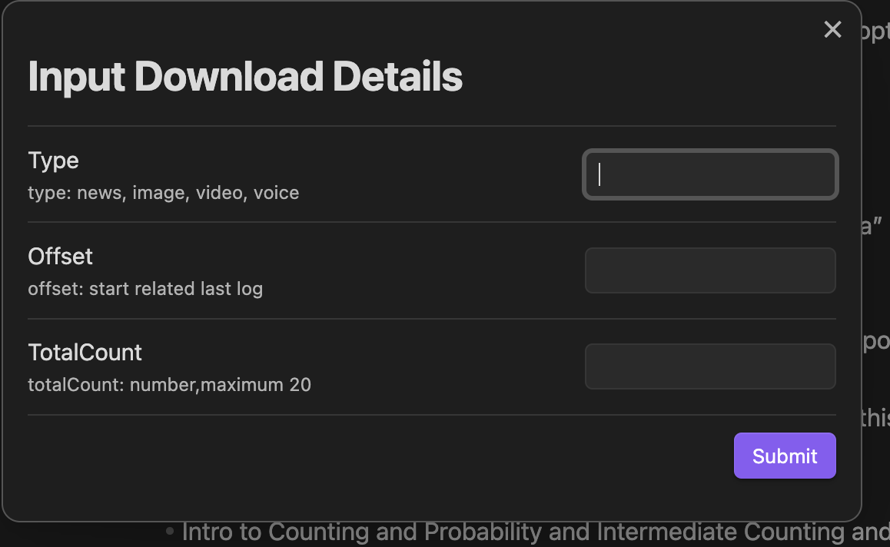
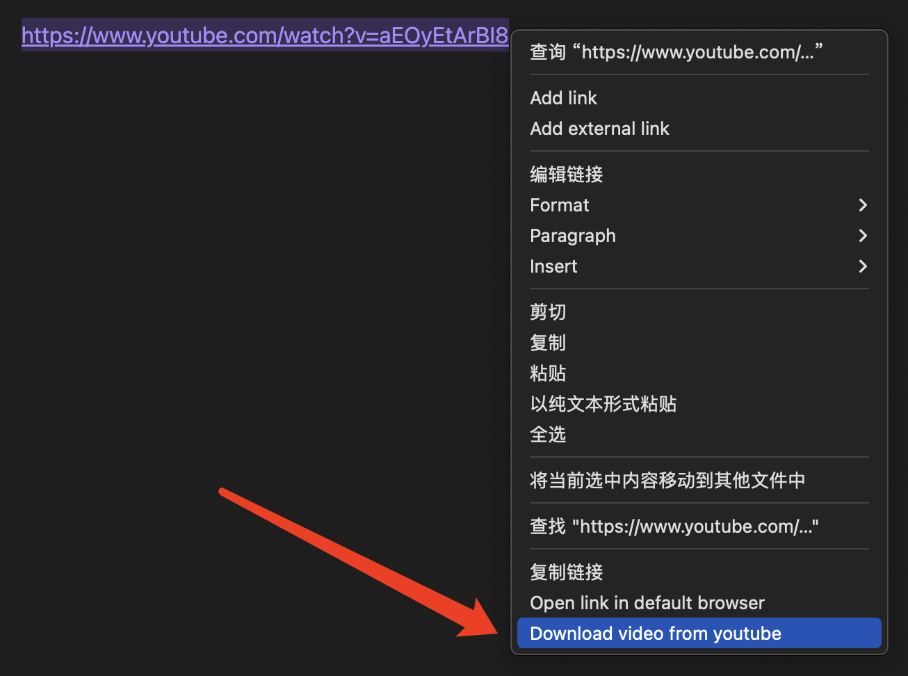
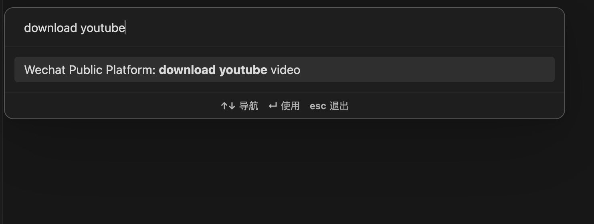
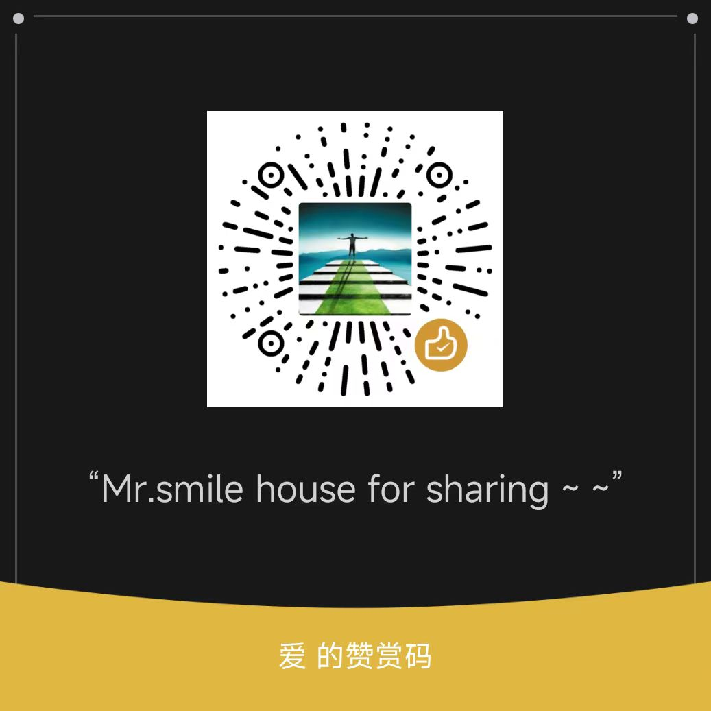

# Obsidian Wechat Public Plugin

[](https://github.com/ai-chen2050/obsidian-wechat-public-platform/actions/workflows/CI.yml)
[](https://github.com/ai-chen2050/obsidian-wechat-public-platform/actions/workflows/release.yml)
[](https://github.com/ai-chen2050/obsidian-wechat-public-platform/blob/master/LICENSE)
[](https://GitHub.com/ai-chen2050/obsidian-wechat-public-platform/releases/)
[](https://github.com/ai-chen2050/obsidian-wechat-public-platform/releases)

[EN English](./README.md)

[黑曜石](https://obsidian.md/) 微信公众平台插件是黑曜石社区插件，用于将黑曜石中的文章或视频等资源发布到微信公众号。

## 中文演示视频

- 中文视频演示请点击下面图片
<br>
<br>

|    Wechat Public Platform    |    Youtube Downloader    |
|:-----------:|:-----------:|
| <a href="https://www.bilibili.com/video/BV1re411z7Ey?t=13.4">  </a> | <a href="https://www.bilibili.com/video/BV1re411z7Ey?t=13.4">  </a>  |


## 发布历史
https://github.com/ai-chen2050/obsidian-wechat-public-platform/releases

## 功能及命令

- [ upload material to WeChatPublic ]【微信公众号上传素材】将资源图片、视频上传至微信公众号资源管理（等待黑曜石支持formdata体）
- [ add draft to WeChatPublic ]【微信公众平台添加草稿】微信公众平台草稿箱添加图文资源
- [ Release article to WeChatPublic ]【微信公众号发布文章】发布图文消息及各类资源并发布到微信公众平台
- [ Send all fans to WeChatPublic ]【微信公众号发送所有费用】给粉丝群发消息（注：**需要认证有群发权限**）
- [download youtube video] 下载 YouTube 上的视频

<br>

---

|    Overall    |    Down/Upload    |
|:-----------:|:-----------:|
|  |   |
| |  |

---

|    Memu Downloader    |    Commands Downloader   |
|:-----------:|:-----------:|
|  |   |

---

## 安装

直接在插件市场搜索“微信公众号”，找到“微信公众号插件”，点击“安装”进行安装。 安装完成后，点击“启用”即可启用插件。 

第二种方法是下载[发布包](https://github.com/ai-chen2050/obsidian-wechat-public-platform/releases)，然后创建一个新的目录，名称为wechat-public-plugin，最后把它们放到。obsidian/plugin，然后找到第三个插件来启用。

或者下载源码编译成 main.js 和 manifest.json 放到插件目录下的.obsidian下，然后Enable。

## 使用

### 文章属性字段

- 建议使用以下要发布的文章的 frontmatter。 该插件将使用以下字段

```yaml
author: Blake   // for article author
thumb_media_id: "awM_2hMypzpKEBfvr0B09MPmBahsXrBzBhNAzIPXHzRYGjzErk7ZBs4L8nL7VpEY" // media id in wechat platform
banner: "https://images.unsplash.com/photo-1620266757065-5814239881fd?ixlib=rb-4.0.3&q=85&fm=jpg&crop=entropy&cs=srgb&w=2400"
banner_path: "twitter.jpg"  // image file path
open_comment: 0
source_url: ""  // ref article url source
digest: ""
```

- 文章封面：微信公众平台内部资源thumb_media_id优先级最高时，其次是网络图片banner，最后是黑曜石本地图片路径
- 其他字段填写微信公众平台发表文章的相关信息。

### AppId 和 Secret 秘钥用于调用微信公众平台接口

- [登录](https://mp.weixin.qq.com/)腾讯微信服务器，进入设置和开发页面。
- 并找到设置和开发页面的基本设置子页面。 将 appid 和 Secret 复制到插件设置中。

### 白名单

- 微信平台请求用户将客户端IP加入服务器白名单。 它与 API 密钥和秘密在同一页面。
- 您可以在[此处](https://tool.lu/ip/)找到您的外网IP。
- 如果你的网络ip是[192.168.66.66]，则输入ip [192.168.0.0/16]或[192.168.66.66], 因为有的 IP 可能会变动。
  
## Wechat public API
[Wechat API](./docs/wepublic.md)

## Support & Funding


| Halo | World |
|:-----------:|:-----------:|
|||


<div align="right">
<a href="https://www.buymeacoffee.com/blakechan" target="_blank"></a>
</div>


## Star 历史

[](https://star-history.com/#ai-chen2050/obsidian-wechat-public-platform&Date)

