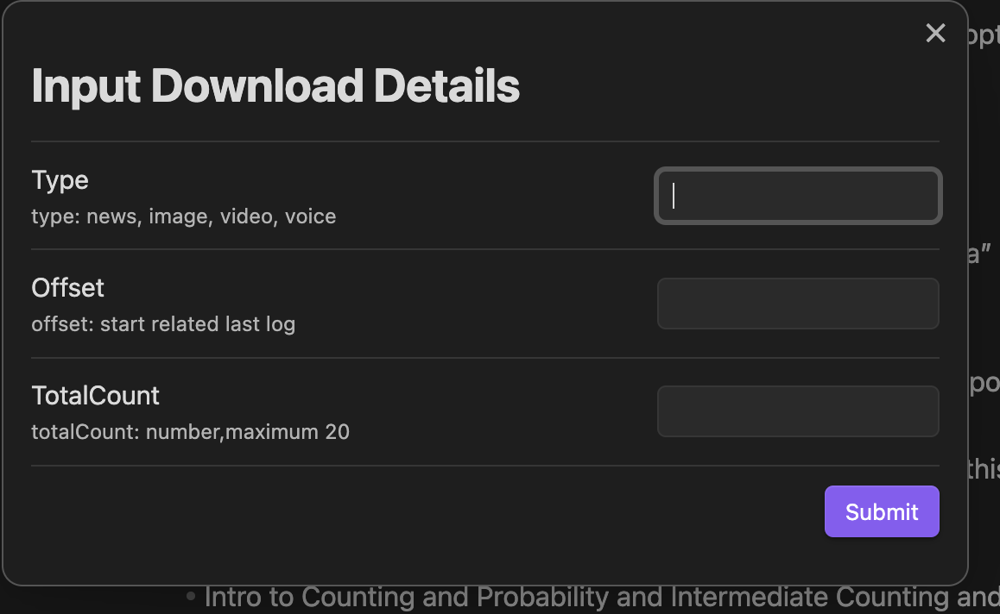
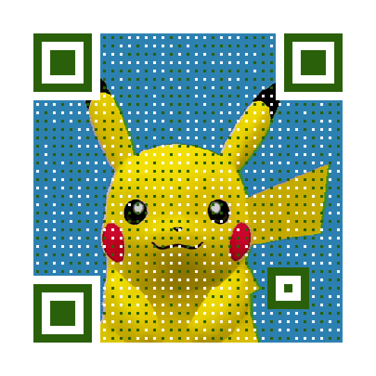

# Obsidian Wechat Public Plugin

[](https://github.com/ai-chen2050/obsidian-wechat-public-platform/actions/workflows/CI.yml)
[](https://github.com/ai-chen2050/obsidian-wechat-public-platform/actions/workflows/release.yml)
[](https://github.com/ai-chen2050/obsidian-wechat-public-platform/blob/master/LICENSE)
[](https://GitHub.com/ai-chen2050/obsidian-wechat-public-platform/releases/)
[](https://github.com/ai-chen2050/obsidian-wechat-public-platform/releases)

[ZH 中文](./README-zh.md) 


The [Obsidian](https://obsidian.md/) WeChat public platform plug-in is an obsidian community plug-in that is used to publish articles or videos and other resources in obsidian to the WeChat public account.


## Video Walkthrough

- Chinese Video Display 中文视频演示请点击下面图片
<br>

- <a href="https://www.bilibili.com/video/BV1re411z7Ey?t=13.4">
  
</a>


## Release history
https://github.com/ai-chen2050/obsidian-wechat-public-platform/releases

## Functions & Command

- [ upload material to WeChatPublic ] Upload resource pictures and videos to WeChat public account resource management (waiting for obsidian to support formdata body)
- [ add draft to WeChatPublic ] Add graphic and text resources to the draft box of WeChat public platform
- [ Release article to WeChatPublic ] Release graphic messages and various resources and publish them on the WeChat public platform
- [ Send all fans to WeChatPublic ] Send group messages to fans (note: authentication is required to have calling permission)
- [download-material-from-wechatpublic] download material(news,image,video,audio) from wechat public platform

<br>

---

|    Overall    |    Down/Upload    |
|:-----------:|:-----------:|
|  |   |
| |  |

---


## Install

Directly search for `wechat public` in the plug-in market, find `Wechat public Plugin` and click `install` to install it. After the installation is complete, click `Enable` to enable the plug-in. [png]

Second method is download the [release](https://github.com/ai-chen2050/obsidian-wechat-public-platform/releases) package, then make a new dir, name to wechat-public-plugin, last put them to .obsidian/plugin, and find 3rd plugin to enable.

Or download the source code and compile it into main.js manifest.json and put it in the plug-in directory under .obsidian, and then Enable.

## Using case

### Article frontmatter annotation

- It is recommended to use the following frontmatter. This plug-in will use the following fields

```yaml
author: Blake   // for article author
thumb_media_id: "awM_2hMypzpKEBfvr0B09MPmBahsXrBzBhNAzIPXHzRYGjzErk7ZBs4L8nL7VpEY" // media id in wechat platform
banner: "https://images.unsplash.com/photo-1620266757065-5814239881fd?ixlib=rb-4.0.3&q=85&fm=jpg&crop=entropy&cs=srgb&w=2400"
banner_path: "twitter.jpg"  // image file path
open_comment: 0
source_url: ""  // ref article url source
digest: ""
```

- Article cover: When the WeChat public platform internal resource thumb_media_id has the highest priority, followed by the network image banner, and finally the local image path of obsidian
- Other fields will be filled with relevant information about articles published on the WeChat public platform.

### API Key And Secret

- [Login](https://mp.weixin.qq.com/) Tencent Wechat Server, go into Setting and Develop page.
- And find the basic setting subpage of Setting and Develop page. copy appid and secret to plugin setting.

### whiteList

- The wechat platform request user put the client Ip to server whitelist. It's same page with API Key and Secret.
- You could find your outneter ip in [here](https://tool.lu/ip/). 
- And put ip [192.168.0.0/16] or [192.168.66.66] if you out network ip is [192.168.66.66]

## Wechat public API
[Wechat API](./docs/wepublic.md)

## Support & Funding


| Halo | World |
|:-----------:|:-----------:|
|||


<div align="right">
<a href="https://www.buymeacoffee.com/blakechan" target="_blank"></a>
</div>


## Star History

[](https://star-history.com/#ai-chen2050/obsidian-wechat-public-platform&Date)

